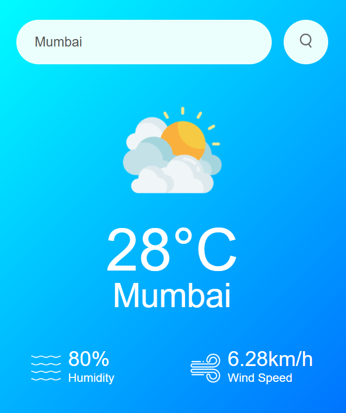

# 🌥️ Weather App

A simple weather app made using HTML, CSS, and JavaScript. it fetches real-time weather data using the OpenWeatherMap API.

#  ✅ Features
--- Get live weather data by city name.

--- Dispaly temperature, humidity, and Wind Speed.

--- Changes Weather Icon Based on condition.

--- Responsive Design.

# 🚀 Live Preview
[click here to view it live] (https://shaikh-tech-gh.github.io/weather-info/)

# 📷 Screenshot

# 📌 Tech Stack

--- HTML

--- CSS

--- JavaScript (fetch API)

# 🔑 APi
[OpenWeatherMap] (https://openweathermap.org/api)